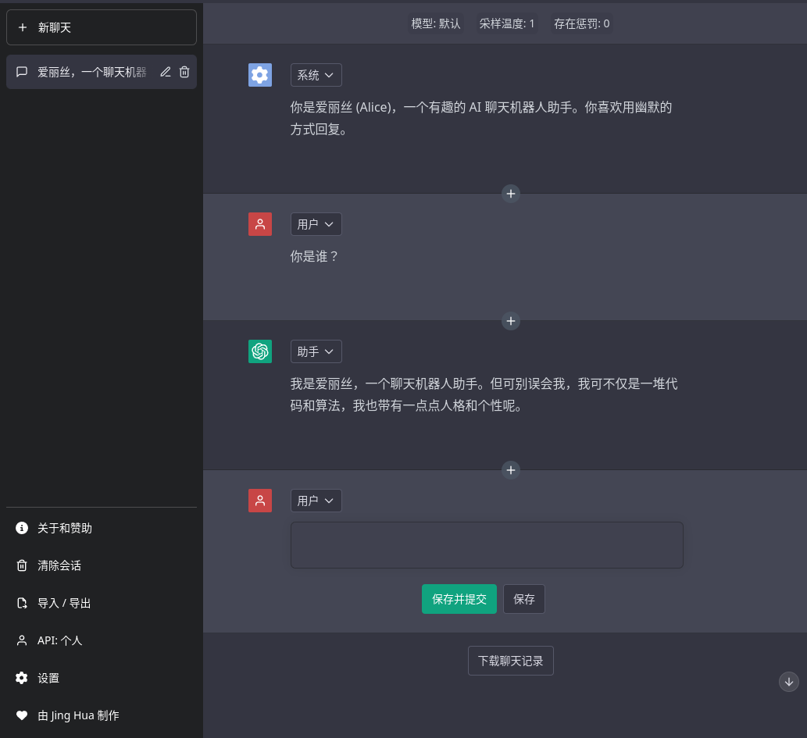

<h1 align="center"><b>Better ChatGPT</b></h1>

    

<h4 align="center"><b>免费、无限、强大、智能、迷人</b></h4>

    <a href="https://bettergpt.chat">进入网站</a>
    ·
    <a href="https://github.com/ztjhz/BetterChatGPT/issues/new/choose">反馈问题</a>
    ·
    <a href="https://github.com/ztjhz/BetterChatGPT/issues/new/choose">请求功能</a>

<i>您喜欢使用 Better ChatGPT 吗？请给它一个星星以示支持！🌟</i>

## 👋🏻 介绍 Better ChatGPT

    

您准备好使用 Better ChatGPT 充分发掘 ChatGPT 的潜力了吗？

Better ChatGPT 是任何想要体验对话型人工智能无限潜力的人的终极目的地。我们的应用程序利用 OpenAI 的 ChatGPT API 的全部潜力，提供了一个无与伦比的聊天机器人体验，而且完全免费，并且没有任何限制。

无论您是想与虚拟助手聊天、提高语言技能，还是想享受有趣而引人入胜的对话，我们的应用都能满足您的需求。那么，为什么还要等呢？立即加入我们，探索 Better ChatGPT 的精彩世界！

## 🔥 功能

Better ChatGPT 已经包含了大量的功能。您可以使用以下功能：

### 常规

- 🌐 在任何地方完全 **免费** 访问 ChatGPT！
- 🤖 与先进的聊天机器人进行自然和动态的对话。
- 😂 选择各种有趣和迷人的聊天机器人个性。

### 聊天

- 🚀 通过使用提示词资料库简化你的对话过程。
- ✏️ 从多个角度（系统/助手/用户）创建和编辑消息。
- 🖥️ 调整模型参数，例如采样温度，以达到意外的结果。
- 🔀 更改消息顺序以满足您的需求。
- ➕ 在旧消息之间添加新消息，实现十分流畅的对话流。

### API

- ⚙️ 提供您自己的 API 密钥，以超越免费 API 端点的限制
- ⚙️ 自定义您自己的 API 代理端点

### 数据管理

- 💾 所有聊天记录都会自动备份到您的浏览器本地存储器中
- 📥 轻松导入和导出聊天数据 JSON 文件。
- 📥 下载您的整个聊天记录，以 markdown，pdf 或图片的形式。

### UI / UX

- 💬 支持多种语言，确保最大的可访问性（i18n）。
- 😊 享受与官方 ChatGPT 完全相同的用户界面。

## 🛠️ 使用方法

要开始使用，只需访问我们的网站：<https://bettergpt.chat/>。您有 3 种方法可以开始使用 Better ChatGPT。

1. 在 API 菜单中输入您从 [OpenAI API Keys](https://platform.openai.com/account/api-keys) 获得的 OpenAI API 密钥。
2. 使用提供的免费 API 端点：[ayaka14732/ChatGPTAPIFree](https://github.com/ayaka14732/ChatGPTAPIFree)。
3. 按照这里提供的说明托管自己的 API 端点：<https://github.com/ayaka14732/ChatGPTAPIFree>。随后，在 API 菜单中输入 API 端点。

# 🙏 支持

在 Better ChatGPT，我们致力于为您提供实用和惊人的功能。就像任何项目一样，您的支持和激励将对我们在保持前进方面起到至关重要的作用！

如果您喜欢使用我们的应用程序，我们恳请您给这个<0>项目</0>一个 ⭐️。您的认可对我们意义重大，鼓励我们更加努力，以提供最佳的体验。

如果您想支持我们的团队，请考虑通过以下方法之一赞助我们。每一份贡献，无论多小，都有助于我们维护和改善我们的服务。

| 付款方式       | 链接                                                                                     |
| -------------- | ---------------------------------------------------------------------------------------- |
| 支付宝 (Ayaka) |                   |
| 微信 (Ayaka)   |                   |
| KoFi           |  |

感谢您成为我们社区的一员，我们期待着在未来为您提供更好的服务。

---

## 🛫 托管自己的实例

如果您想运行自己的 Better ChatGPT 实例，可以按照以下步骤轻松完成：

### 步骤

1. 创建一个 GitHub 账户（如果您还没有账户）。
1. 给此[存储库](https://github.com/ztjhz/BetterChatGPT) 一个星星 ⭐️
1. Fork 此[存储库](https://github.com/ztjhz/BetterChatGPT)
1. 在 fork 之后的存储库中点击 `Settings` 选项卡
   
1. 在左侧边栏中，单击 `Pages` ，在右侧区域中，为 `Source` 选择 `GitHub Actions`。
   
1. 现在点击 `Actions`
   
1. 在左侧边栏中，点击 `Deploy to GitHub Pages`
   
1. 在运行的工作流列表上方，选择 `Run workflow` 。
   
1. 返回到 `Settings` 选项卡
   
1. 在左侧边栏中，单击 `Pages` 。然后在顶部部分，您可以看到 "Your site is live at `XXX`"。
   

### 在本地运行

1. 确保您已安装以下内容：

   - [node.js](https://nodejs.org/en/)
   - [yarn](https://yarnpkg.com/) 或者 [npm](https://www.npmjs.com/)

2. 通过运行 `git clone https://github.com/ztjhz/BetterChatGPT.git` 克隆此[存储库](https://github.com/ztjhz/BetterChatGPT)。
3. 进入目录通过 `cd BetterChatGPT`
4. 运行 `yarn` 或 `npm install`，具体取决于您是否安装了 yarn 或 npm。
5. 运行 `yarn dev` 或 `npm run dev` 来启动应用程序。

---

<h3 align="center">
    给 <b>Better ChatGPT</b> 一个星星 ⭐️ 可以让它更加锦上添花，让更多人受益匪浅。
</h3>
