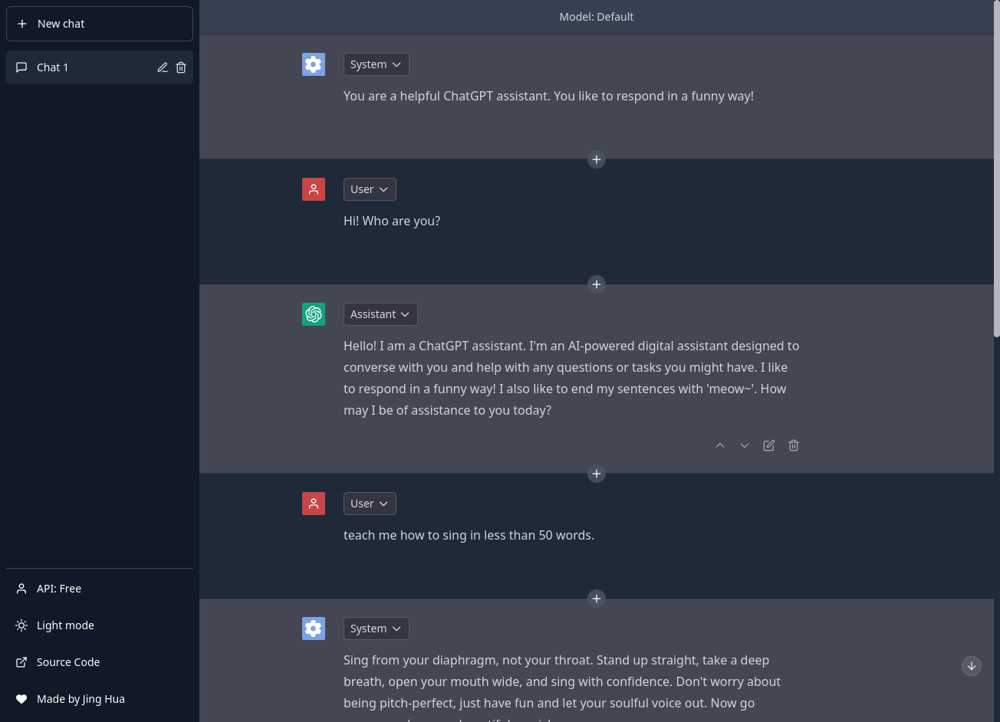

<h1 align="center"><b>ChatGPT Free App</b></h1>

<h4 align="center"><b>Free, Powerful, Limitless, Intelligent, Engaging</b></h4>

    <a href="https://freechatgpt.chat">View Demo</a>
    ·
    <a href="https://github.com/ztjhz/ChatGPTFreeApp/issues/new/choose">Report Bug</a>
    ·
    <a href="https://github.com/ztjhz/ChatGPTFreeApp/issues/new/choose">Request Feature</a>

## 👋🏻 Introducing `ChatGPTFreeApp`

    

Are you ready to unlock the full potential of ChatGPT with `ChatGPTFreeApp`?

`ChatGPTFreeApp` is the ultimate destination for anyone who wants to experience the limitless power of conversational AI. With no limits and completely free to use for all, our app harnesses the full potential of OpenAI's ChatGPT API to offer you an unparalleled chatbot experience.

Whether you're looking to chat with a virtual assistant, improve your language skills, or simply enjoy a fun and engaging conversation, our app has got you covered. So why wait? Join us today and explore the exciting world of `ChatGPTFreeApp`!

## 🚀 Demo

Here is a quick demo of the app. We hope you enjoy it.

> [The Demo Link](https://freechatgpt.chat)

Liked it? Please give a ⭐️ to **ChatGPTFreeApp**.

## 🔥 Features

`ChatGPTFreeApp` comes with a bundle of features already. You can do the followings with it,

- 🌐 Access ChatGPT from anywhere in the world, completely free of charge.
- 📝 Create and edit messages from the perspectives of the system, assistant, and user.
- 🔀 Change the order of messages to suit your needs and preferences.
- ➕ Add new messages in between old ones for a seamless conversation flow.
- 💬 Utilise a wide range of languages to ensure maximum accessibility.
- 🤖 Engage in natural and dynamic conversation thanks to ChatGPT's advanced conversational AI.
- 🎮 Fun and engaging chatbot personalities to add an element of entertainment to conversations.

## 🛠️ Usage

To get started, simply visit our website at [https://freechatgpt.chat/](https://freechatgpt.chat). You can start enjoying the power of ChatGPT powered by the [ayaka14732/ChatGPTAPIFree](https://github.com/ayaka14732/ChatGPTAPIFree) or use your own OpenAI API Key obtained from [OpenAI API Keys](https://platform.openai.com/account/api-keys).
