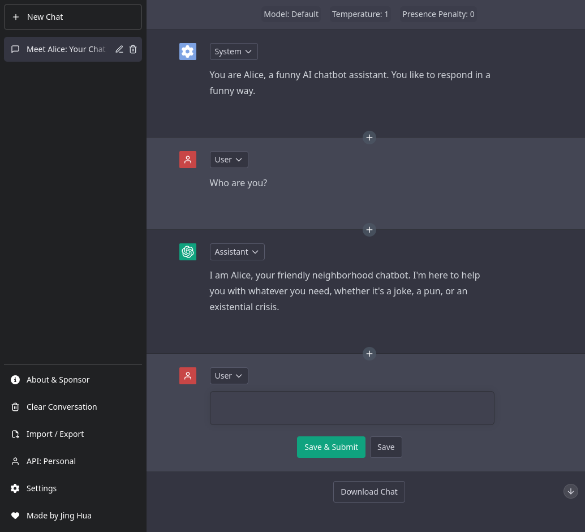

<h1 align="center"><b>ChatGPT Free App</b></h1>

   <a href="README-zh_CN.md">
      简体中文版
   </a>

<h4 align="center"><b>Free, Powerful, Limitless, Intelligent, Engaging</b></h4>

    <a href="https://freechatgpt.chat">View Demo</a>
    ·
    <a href="https://github.com/ztjhz/ChatGPTFreeApp/issues/new/choose">Report Bug</a>
    ·
    <a href="https://github.com/ztjhz/ChatGPTFreeApp/issues/new/choose">Request Feature</a>

<i>Did you enjoy using ChatGPTFreeApp? Give it some love with a star! 🌟</i>

## 👋🏻 Introducing `ChatGPTFreeApp`

    

Are you ready to unlock the full potential of ChatGPT with `ChatGPTFreeApp`?

`ChatGPTFreeApp` is the ultimate destination for anyone who wants to experience the limitless power of conversational AI. With no limits and completely free to use for all, our app harnesses the full potential of OpenAI's ChatGPT API to offer you an unparalleled chatbot experience.

Whether you're looking to chat with a virtual assistant, improve your language skills, or simply enjoy a fun and engaging conversation, our app has got you covered. So why wait? Join us today and explore the exciting world of `ChatGPTFreeApp`!

## 🔥 Features

`ChatGPTFreeApp` comes with a bundle of features already. You can do the followings with it,

### General

- 🌐 Access ChatGPT from anywhere in the world, completely **FREE** of charge!
- 🤖 Engage in natural and dynamic conversation with a cutting-edge chatbot.
- 😂 Choose from a variety of fun and engaging chatbot personalities.

### Chat

- ✏️ Create and edit messages from multiple perspectives (system / assistant / user).
- 🖥️ Tweak model parameters such as temperature to achieve an unexpected outcome.
- 🔀 Change the order of messages to suit your needs.
- ➕ Add new messages in between old ones for a seamless conversation flow.

### API

- ⚙️ Supply your own API key to surpass limits of free API endpoint
- ⚙️ Customise your own API proxy endpoint

### Data management

- 💾 All chat history are automatically backed up to your browser's local storage
- 📥 Easily import and export chat data as a JSON file.
- 📥 Download your entire chat log as markdown, pdf or image.

### UI / UX

- 💬 Supports multiple languages to ensure maximum accessibility (i18n).
- 😊 Enjoy a UI that is identical to the official ChatGPT

## 🛠️ Usage

To get started, simply visit our website at <https://freechatgpt.chat/>. There are 3 ways for you to start using `ChatGPTFreeApp`.

1. Enter into the API menu your OpenAI API Key obtained from [OpenAI API Keys](https://platform.openai.com/account/api-keys).
2. Utilise the free api endpoint provided by [ayaka14732/ChatGPTAPIFree](https://github.com/ayaka14732/ChatGPTAPIFree)
3. Host your own API endpoint by following the instructions provided here: <https://github.com/ayaka14732/ChatGPTAPIFree>. Subsequently, enter the API endpoint into the API menu.

# 🙏 Support

At `ChatGPTFreeApp`, we strive to provide you with useful and amazing features around the clock. And just like any project, your support and motivation will be instrumental in helping us keep moving forward!

If you have enjoyed using our app, we kindly ask you to give this project a ⭐️. Your endorsement means a lot to us and encourages us to work harder towards delivering the best possible experience.

If you would like to support the team, consider sponsoring us through one of the methods below. Every contribution, no matter how small, helps us to maintain and improve our service.

| Payment Method | Link                                                                                   |
| -------------- | -------------------------------------------------------------------------------------- |
| KoFi           |  |
| Alipay (Ayaka) |                 |
| Wechat (Ayaka) |                 |

Thank you for being a part of our community, and we look forward to serving you better in the future.

---

## 🛫 Host your own Instance

If you'd like to run your own instance of `ChatGPTFreeApp`, you can easily do so by following these steps:

### Steps

1. Create a GitHub account (if you don't have one already)
2. Star this [repository](https://github.com/ztjhz/ChatGPTFreeApp) ⭐️
3. Fork this [repository](https://github.com/ztjhz/ChatGPTFreeApp)
4. In your forked repository, click on `Actions`
   
5. In the left sidebar, click on `Deploy to GitHub Pages`
   
6. Above the list of workflow runs, select `Run workflow`.
   
7. Now, navigate to the `Settings` tab
   
8. In the left sidebar, click on `Pages` and in the right section, select `Deploy from a branch` for `Source` and `gh-pages` for `Branch`. Then at the top section, you can see that "Your site is live at `XXX`".
   

### Running it locally

1. Ensure that you have the following installed:

   - [node.js](https://nodejs.org/en/)
   - [yarn](https://yarnpkg.com/) or [npm](https://www.npmjs.com/)

2. Clone this [repository](https://github.com/ztjhz/ChatGPTFreeApp) by running `git clone https://github.com/ztjhz/ChatGPTFreeApp.git`
3. Navigate into the directory by running `cd ChatGPTFreeApp`
4. Run `yarn` or `npm install`, depending on whether you have yarn or npm installed.
5. Launch the app by running `yarn dev` or `npm run dev`

---

<h3 align="center">
A ⭐️ to <b>ChatGPTFreeApp</b> is to make it shine brighter and benefit more people.
</h3>
